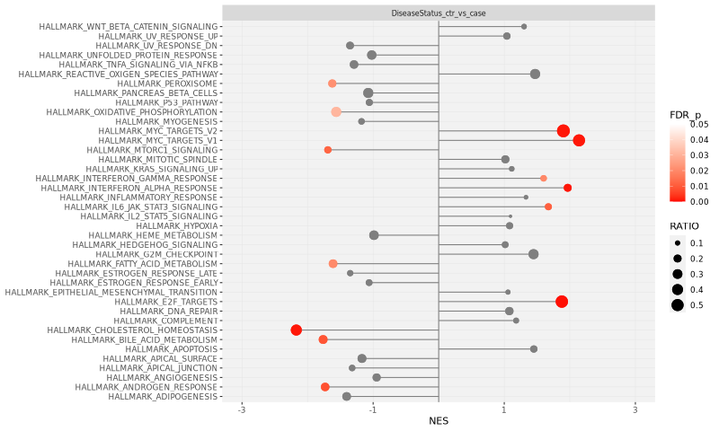

# DGE2: Output

## Introduction

This document describes the output produced by the pipeline.

The directories listed below will be created in the results directory after the pipeline has finished. All paths are relative to the top-level results directory.

<!-- TODO nf-core: Write this documentation describing your workflow's output -->

## Pipeline overview

The pipeline is built using [Nextflow](https://www.nextflow.io/) and processes data using two main steps, DESeq2 and GSEA:

- [DESeq2](#deseq2) - For differential gene expression analysis
- [GSEA](#gsea) - For gene set enrichment analysis
- [Pipeline information](#pipeline-information) - Report metrics generated during the workflow execution

### DESeq2

The [DESeq2](https://bioconductor.org/packages/release/bioc/html/DESeq2.html) package is used for differential gene expression analysis. The pipeline produces a text file with the differential gene expression results, plots, and an HTML report that contains a summary of the DGE results.

Output files

- `DGE2_PlotsAndFiles/`
  - `PCAplot.png`: PCA plot
  - `Condition_treatment_vs_control/`: There will be one "Condition_treatment_vs_control" folder per comparison (e.g. contrast), containing a file and several plots:
    - Condition_treatment_vs_control_VolcanoPlot.png
    - Condition_treatment_vs_control_MAplot.png
    - Condition_treatment_vs_control_heatmap.png
    - Condition_treatment_vs_control_results.txt
- `DGE2_report/`
  - `DGE2.html`: HTML report containing a summary of the DGE results, including the files and plots above

### GSEA

[GSEA](http://software.broadinstitute.org/gsea/index.jsp) is used to look for enrichment of gene sets at the top or bottom of the rnaked list of genes obtained from the DGE analysis. The [hallmark gene
sets](http://software.broadinstitute.org/gsea/msigdb/collections.jsp) from MSigDB is used by default.

Output files

- `GSEA/`
  - `Condition_treatment_vs_control/`: There will be one "Condition_treatment_vs_control" folder per comparison (e.g. contrast), containing a folder with the typical results obtained from running GSEA, as well as a plot that summarizes the results:
    - gsea_results/my_analysis.GseaPreranked.xxxxxxxxxxxxx
    - gsea_plot.png

### Pipeline information

Output files

- `pipeline_info/`
  - Reports generated by Nextflow: `execution_report.html`, `execution_timeline.html`, `execution_trace.txt` and `pipeline_dag.dot`/`pipeline_dag.svg`.
  - Reports generated by the pipeline: `pipeline_report.html`, `pipeline_report.txt` and `software_versions.yml`. The `pipeline_report*` files will only be present if the `--email` / `--email_on_fail` parameter's are used when running the pipeline.
  - Reformatted samplesheet files used as input to the pipeline: `samplesheet.valid.csv`.
  - Parameters used by the pipeline run: `params.json`.

[Nextflow](https://www.nextflow.io/docs/latest/tracing.html) provides excellent functionality for generating various reports relevant to the running and execution of the pipeline. This will allow you to troubleshoot errors with the running of the pipeline, and also provide you with other information such as launch commands, run times and resource usage.

## Test output folder

`nextflow run lconde-ucl/DGE2 -profile test,singularity --outdir results_dge
`
The results from running the above command can be downloaded from [here](https://downgit.evecalm.com/#/home?url=https://github.com/lconde-ucl/DGE2/tree/master/assets/test_datasets/results_dge)

